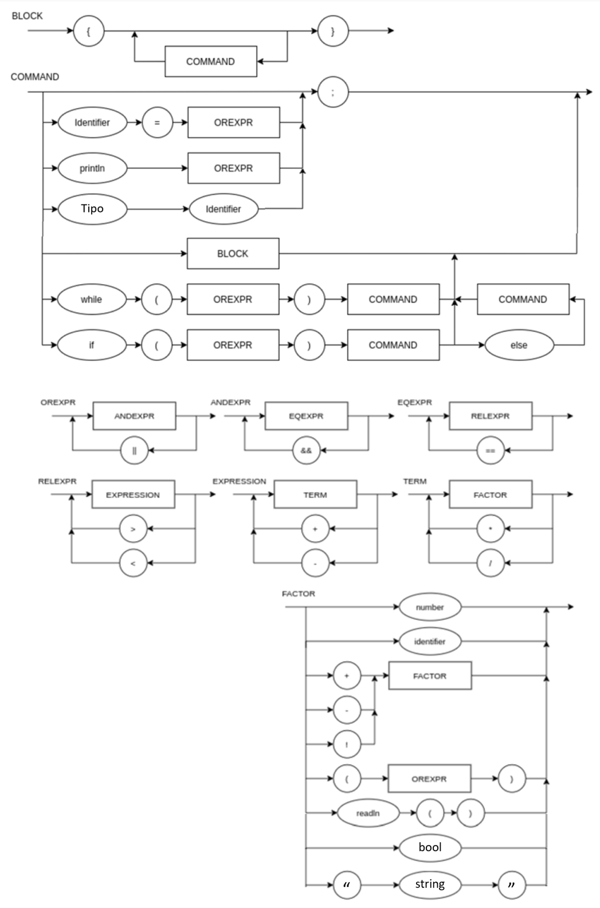

# LogicaComputacao
Repositório para disciplina Lógica da Computação 2021.1

## Status dos Testes


## Projeto

O projeto consiste em construir um programa que recebe como argumento uma cadeia de operações de números inteiros de múltiplos dígitos as realiza. 

Para rodá-lo, basta inserir as operações a serem realizadas em um ```arquivo.c``` a sua escolha. Ele pode conter múltiplas expressões (soma, multiplicação, parênteses, comentários, etc), sem aspas, disposta entre linhas separadas por ";". A linguagem suporta identificadores (atribuições de variáveis) e prints. Segue exemplo abaixo:

```
a = 2;
b = a + 3; /*commentario*/
b = b - 3;
println /*comentario*/ ((b + /*comentario*/ 1) * 2);
```

Feito isso, é possível chamar o programa passando o nome do arquivo via linha de comando. Por exemplo:

```
python3 main.py {nome do seu arquivo}.c
```

EBNF:

```
BLOCK = "{", { COMMAND }, "}" ;
COMMAND = ( λ | ASSIGNMENT | PRINT | WHILE | IF | BLOCK | TYPE ), ";" ;
TYPE = ( "int" | "bool" | "string" ), IDENTIFIER ; 
ASSIGNMENT = IDENTIFIER, "=", OREXPR ;
PRINT = "println", "(", OREXPR, ")" ;
WHILE = "while", "(", OREXPR, ")", "{", COMMAND, "}" ;
IF = "if", "(", OREXPR, ")", "{", COMMAND, "}", { "else", "{", COMMAND, "}" } ;
OREXPR = ANDEXPR, { "||", ANDEXPR } ;
ANDEXPR = EQEXPR, { "&&", EQEXPR } ;
EQEXPR = RELEXPR, { "==", RELEXPR } ;
RELEXPR = EXPRESSION, { (">" | "<"), EXPRESSION } ;
EXPRESSION = TERM, { ("+" | "-"), TERM } ;
TERM = FACTOR, { ("*" | "/"), FACTOR } ;
FACTOR = (("+" | "-" | "!"), FACTOR) | NUMBER | "(", OREXPR, ")" | IDENTIFIER | READLINE | BOOL | '"', STRING, '"';
BOOL = "true" | "false"
IDENTIFIER = LETTER, { LETTER | DIGIT | "_" } ;
READLINE = "readln", "(", ")" ;
NUMBER = DIGIT, { DIGIT } ;
LETTER = ( a | ... | z | A | ... | Z ) ;
DIGIT = ( 1 | 2 | 3 | 4 | 5 | 6 | 7 | 8 | 9 | 0 ) ; 
```

Além de parênteses, o programa suporta o uso de comentários na expressão também. Para inserir um basta usar a seguinte notação:

```
x = (3+2)/5 /* comentário */
```

## Diagrama Sintático


